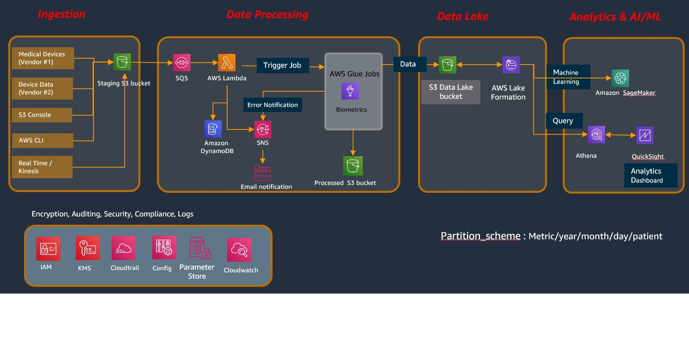

# AWS Analysis of Medical Device Data using Data Lake 

This solution is built to allow ingestion of Medical Device Data into a Data Lake. 
The sources of data can be diverse. The current solution is designed for ingestion via files . 
It is recommended that you run the [HIPAA QuickStart](https://docs.aws.amazon.com/quickstart/latest/compliance-hipaa/templates.html) prior to running the scripts here.


## Architecture 

Data encryption provides a strong layer of security to protect data that you store within AWS services. AWS services can help you achieve ubiquitous encryption 
for data in transit as well as data at rest.

<a></a>

### Ingestion 
In the Ingestion segment  this solution cerates the following component 
1. Staging S3 Bucket : It will be used to ingest raw dataset from the source. 

### Data Processing
In the Data Processing segment, this solution creates the following components
1. SQS Queue : Holds list of files that are yet to be processed or in-processing
2. AWS Lambda : This processes 1 file at a time from the SQS Queue
3. DynamoDB : Holds the list of file names already processed. Used for duplicate file detection
4. SNS : Creates a topic and subscription for any error notification
5. Glue : Sample Glue job is created based on the file  you will be downloading and saving to the S3 location later
6. S3 Processed Bucket : This will hold the raw files that are moved away from the Staging Bucket once processing is successful. 

### Data Lake
In the Data Lake segment this solution creates the following components
1. S3 Data Lake Bucket : This bucket holds the content of the data lake in the specified partition_schme : Metric/year/month/day/patient

The  AWS Lake Formation component can be created using the instructions from [here](https://docs.aws.amazon.com/lake-formation/latest/dg/how-it-works.html)
 
### Analytics & AI/ML
In the Analytics segment, this solution doesn't  create any components.
The architecture diagram  is showing the possibilities of using the data from  Data Lake . 

This architecture uses IAM Policies for Service based access, KMS keys for encryption of S3 buckets, DynamoDB, Parameter Store
The Parameter Store is used to save the values of 
1. DataLake Bucket Name
2. Data Lake folder Name
3. Processed Bucket Name
4. Processed Bucket Folder Name
5. SQS Queue Name 
6. Failure Notification ARN
7. Athena Database to use for creating the tables. 

The processing Logs will be recorded in the Cloudwatch logs. 


### Installation
This script does not create the VPC, subnets , route tables etc.  

0. Please ensure that you have run the [HIPAA QuickStart](https://docs.aws.amazon.com/quickstart/latest/compliance-hipaa/templates.html)

To get started now, just sign in to your AWS account and create a stack based on criteria below. 
1. ```git clone git@github.com:aws-samples/analysis-of-medical-device-data-using-data-lake.git```
2. Upload the sample heart_rate_job.py to your S3 bucket and copy the location 
```cd analysis-of-medical-device-data-using-data-lake```
```aws s3 cp heart_rate_job.py  s3://[YOUR-BUCKET-NAME-HERE]```

Copy the location of the job file s3://[YOUR-BUCKET-NAME-HERE]/heart_rate_job.py


3. If you want to ensure that all traffic to your AWS resources is within the AWS Network,  use the script "Cloudformation_WithVPC.json".  It will create VPC Endpoints for SQS, S3, DynamoDB, Glue, Athena, SSM.
4. If you don't have to ensure all traffic to your AWS resorces is not to be restricted to AWS Network, you can use the script "Cloudformation_WithoutVPC.json". It will create same resources as 

5. Supply all the parameters as required . 


## Security

See [CONTRIBUTING](CONTRIBUTING.md#security-issue-notifications) for more information.

## License

This project is licensed under the Apache-2.0 License. See the [LICENSE](LICENSE) file.

